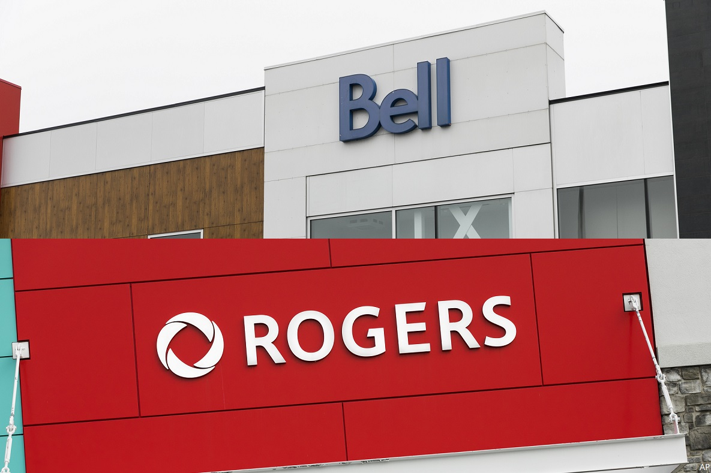

## 📉 Bell Canada's Struggles in 2024: A Deep Dive

### Introduction

Once considered one of Canada’s leading mobile networks, Bell Canada has experienced a marked decline in performance over the past year. As Canadians increasingly rely on mobile networks for both personal and professional needs, Bell's recent struggles have become a significant concern for many users. This article explores the root causes of Bell's declining network performance, compares it to competitors like Rogers, and discusses the implications for consumers in 2024.

### Bell’s Declining Network Quality: What Happened?

#### Upload Speeds: A Critical Weakness

One of the most glaring issues plaguing Bell’s network is its poor upload speed performance. According to a recent [Opensignal report](https://www.opensignal.com), Bell's average upload speed was reported at just 10 Mbps, significantly behind Rogers, which has recently achieved upload speeds of 30 Mbps on average. This difference is substantial and directly impacts user experience, particularly for those who rely on stable and fast uploads for video conferencing, cloud storage, and live streaming.

A real-world example of this disparity is illustrated in a speed test conducted using an AT&T SIM roaming on Rogers, which yielded impressive results of 1267.32 Mbps download and 97.86 Mbps upload. In stark contrast, a Bell SIM roaming on AT&T in the same location showed a dismal 2.52 Mbps download and 0.69 Mbps upload. This stark difference highlights the current performance gap between Bell and Rogers, especially in critical upload speeds:

  
*Rogers (AT&T Roaming): 1267.32 Mbps download / 97.86 Mbps upload*

  
*Bell (AT&T Roaming): 2.52 Mbps download / 0.69 Mbps upload*

These results underscore the challenges Bell is facing in maintaining competitive network performance, particularly when it comes to data-intensive tasks.

#### Coverage Issues: Inconsistent and Unreliable

Coverage consistency is another area where Bell is struggling. Despite the company’s claims of extensive 5G and LTE coverage, users have reported frequent drops to LTE, often finding the service to be almost unusable in certain residential areas. According to an analysis by [WhistleOut](https://www.whistleout.ca), Bell’s coverage, particularly in suburban and rural areas, is less reliable than that of Rogers. The disparity is not just in signal strength but in network stability, with Bell users frequently experiencing outages and inconsistent service.

A particularly striking example of Bell’s coverage issues is evident in a speed test performed with an A1 eSIM roaming on Bell, where the results were shockingly low at 0.28 Mbps download and 0.13 Mbps upload:

  
*Bell (A1 eSIM roaming on Bell): 0.28 Mbps download / 0.13 Mbps upload*

Umlaut, a telecom research firm, rated Bell’s network reliability below that of Rogers and Telus in its most recent evaluation. Bell’s score of 526 out of a possible 573 points, while still respectable, indicates a notable gap compared to Rogers’ 538 points. This gap reflects a broader trend of Bell lagging in network performance metrics, which include not just speed and coverage, but also latency and stability&#8203;:contentReference[oaicite:0]{index=0}.

### Rogers: A Stark Contrast in Network Performance

#### Superior Speed and Coverage

Rogers has emerged as the clear leader in Canada’s mobile network market. In the same [Opensignal report](https://www.opensignal.com), Rogers outperformed Bell in nearly every category, including download and upload speeds, video streaming quality, and gaming experience. Rogers’ upload speeds, in particular, are consistently higher than Bell’s, providing a better experience for users who need reliable and fast connections for data-heavy applications.

In contrast to Bell’s coverage and speed issues, Rogers continues to deliver superior performance, ensuring that users can maintain high-speed connections even under roaming conditions.

#### Customer Satisfaction and Market Perception

Beyond technical performance, Rogers also leads in customer satisfaction. According to recent surveys, Rogers customers report higher levels of satisfaction with both network performance and customer service compared to Bell customers. This is a critical factor, as customer loyalty is often driven by consistent service quality and effective customer support, areas where Bell appears to be struggling.

### Customer Frustrations: A Growing Concern

#### Frequent Outages and Poor Customer Support

The decline in Bell’s network quality is further highlighted by the increasing number of customer complaints. On platforms like [IsTheServiceDown Canada](https://istheservicedowncanada.com), users have shared numerous reports of service outages, dropped calls, and poor customer service experiences. These issues are not isolated incidents but reflect a broader pattern of declining reliability and support from Bell.

Customers have expressed frustration with Bell’s technical support, citing slow response times and unresolved issues. This has led many to consider switching to other providers, with Rogers and Telus being the primary alternatives. The contrast in customer experience between Bell and its competitors is stark, and it underscores the importance of reliable service in maintaining customer loyalty.

### Conclusion: What Does This Mean for Consumers?

Bell Canada's recent performance issues represent a significant shift in the Canadian mobile network landscape. For years, Bell was seen as a top-tier provider, but its recent struggles suggest that it is losing ground to competitors like Rogers. For consumers, this means that choosing a mobile provider is more important than ever.

Those who prioritize reliable service, particularly in areas where Bell's coverage is inconsistent, may find better value with Rogers or Telus. As Bell works to address these challenges, it remains to be seen whether it can regain its former status or if the gap between Bell and its competitors will continue to widen.

### Further Reading and Sources

- [Opensignal Mobile Network Experience Report](https://www.opensignal.com)
- [WhistleOut’s Bell vs. Rogers Analysis](https://www.whistleout.ca)
- [IsTheServiceDown Canada - Bell Outages](https://istheservicedowncanada.com)