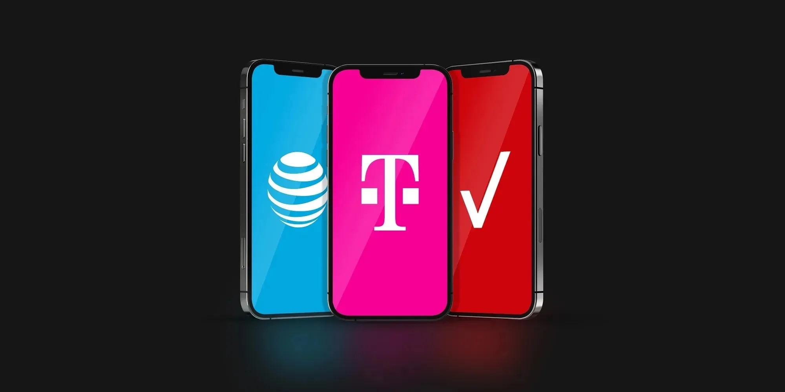

## Introduction to eSIMs for Europe

Traveling to Europe requires reliable mobile connectivity, and eSIMs offer a convenient, cost-effective solution. Unlike traditional SIM cards, eSIMs allow you to activate a mobile data plan digitally without swapping physical cards. This is particularly useful for international travel, where switching between networks and countries is common.

In this guide, we explore the best eSIM options for staying connected in Europe, compare them with traditional U.S. carrier roaming options, and recommend the top plans for various needs.

### Roaming Prices from U.S. Carriers

1. **Verizon**: Verizon's TravelPass is available at $10 per day, enabling you to use your existing domestic data, talk, and text plan in over 185 countries. Although convenient, this option can become costly for extended trips.

2. **AT&T**: AT&T offers a similar International Day Pass at $10 per day, which provides the same services as your domestic plan across more than 200 countries. This pass is ideal for short trips but can add up over longer durations.

3. **T-Mobile**: T-Mobile's Magenta and Magenta Max plans include free international data, though speeds are capped at 2G. For faster data, a high-speed pass can be purchased for $5 per day, making it a flexible yet potentially slower option.

4. **Google Fi**: Google Fi is an excellent choice for international travelers, charging $10 per GB, the same as its domestic rate, with no extra charge for data usage in over 200 destinations. Most notably, __Unlimited Plus users also enjoy unlimited (50GB high-speed) data in all supported countries.__

5. **US Mobile**: US Mobile’s international plans are varied, with prices starting around $10 for 1GB, depending on the region. With the flexibility to switch between multiple networks, US Mobile is a strong contender for frequent travelers.

### Best eSIM Providers for Europe

To avoid high roaming costs, consider these eSIM providers that offer comprehensive plans tailored for European travel:

1. **O2 Travel eSIM**:
   - **Price**: $23 for 50GB of high-speed data.
   - **Coverage**: Available in 48 European countries.
   - **Features**: This plan includes unlimited local calls within the country, mobile hotspot capabilities, and 5G speeds where available. It’s ideal for heavy data users who need reliable, extensive coverage throughout Europe.  **Full 5G mmWave + C-Band Access through Europe**.

2. **Vodafone Travel eSIM**:
   - **Price**: $27 for 25GB of high-speed data.
   - **Coverage**: Covers 75 countries, including both European and non-European destinations.
   - **Features**: Offers unlimited local calls, mobile hotspot usage, and fast 5G connectivity. Vodafone's broad coverage makes it an excellent choice for travelers visiting multiple regions.

3. **O2 Mega eSIM**:
   - **Price**: $29 for 300GB of super-fast data.
   - **Coverage**: Available in 48 European countries.
   - **Features**: This plan provides extensive 5G coverage with no fair usage policy, making it the ultimate option for travelers requiring large amounts of data without throttling. It also includes mobile hotspot capability at no extra cost.

### Additional eSIM Providers

- **Airalo**: Airalo’s Eurolink plan is popular for its affordability and coverage across 39 European countries. Prices start at $5 for 1GB (valid for 7 days) and go up to $185 for 100GB (valid for 180 days). Airalo is widely praised for its customer service and ease of use [source](https://abrokenbackpack.com).

- **Holafly**: Known for offering unlimited data plans, Holafly’s options start at $29 for 7 days and extend to $139 for 90 days. This provider covers 30 European countries and is a strong choice for travelers needing unlimited data, although speeds may vary after extensive usage [source](https://thesavvybackpacker.com).

- **MobiMatter**: MobiMatter offers competitive eSIM packages, such as 50GB for $43.99, valid for 30 days. Their plans are versatile and suitable for various data needs and travel durations, making them a reliable option for travelers [source](https://abrokenbackpack.com).

### Conclusion and Recommendations

For most travelers, the **O2 Travel eSIM** offers an excellent balance of data, coverage, and cost, especially for those visiting multiple countries within Europe. The **Vodafone Travel eSIM** is ideal for those needing reliable connectivity across Europe and beyond. For heavy data users, the **O2 Mega eSIM** provides unbeatable value with 300GB of data, ensuring you stay connected throughout your journey.

These eSIMs provide the flexibility and reliability needed for a seamless travel experience across Europe, often outperforming traditional U.S. carrier roaming plans in both cost and convenience.

For more details and to purchase these eSIMs, visit:
- [O2 Travel eSIM](https://www.esim.net/O2/Travel)
- [Vodafone Travel eSIM](https://www.esim.net/vodafone/travel)
- [O2 Mega eSIM](https://www.esim.net/O2/Mega)
