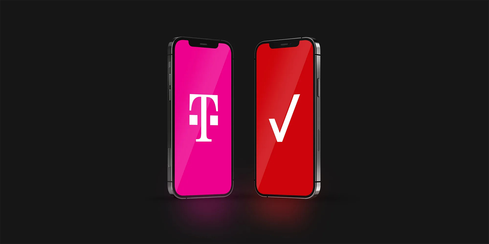

## 📉 User Story Report #1 - T-Mobile's Declining Performance in California

### Opinion by Amogh Gupta

-------------

### Introduction

Once a consistent performer in the Golden State, T-Mobile's network quality in California has seen a noticeable decline in recent years. While the carrier still shines in cities like Chicago, where users enjoy impressive speeds, the situation in California is far less favorable. This article explores the factors behind T-Mobile's uneven performance across different regions, compares it with Verizon's network, and discusses what this means for users in 2024.

### T-Mobile’s Declining Performance in California

#### User Experiences: A Tale of Two Cities

T-Mobile’s inconsistent performance is evident in the real-world experiences of its users. According to Amogh Gupta, a longtime T-Mobile customer, the network in California has become "completely inconsistent," struggling to maintain connections in areas where it was once reliable. Gupta’s speed test at his home in California revealed disappointing results, with a download speed of just 3.13 Mbps and an upload speed of 1.40 Mbps:

  
*T-Mobile at Amogh's house in California: 3.13 Mbps download / 1.40 Mbps upload*

In contrast, during a recent visit to Chicago, Gupta recorded significantly better speeds, with T-Mobile delivering consistent download speeds of around 600 Mbps across the city.

#### Coverage and Speed Discrepancies

T-Mobile’s mid-band 5G, while delivering excellent speeds in dense urban environments like Chicago, appears to be faltering in parts of California. In Santa Clara, Gupta measured a download speed of 249.34 Mbps, but with a disappointingly low upload speed of 2.10 Mbps:

  
*Amogh's T-Mobile Test in Santa Clara, CA: 249.34 Mbps download / 2.10 Mbps upload*

These results highlight the disparities in T-Mobile's network performance across different regions, particularly when compared to the reliability and consistency of Verizon's network.

### Verizon: A More Reliable Alternative

#### Superior Network Quality

While T-Mobile struggles with coverage inconsistencies, Verizon has maintained a reputation for reliable performance, especially in major areas. In a speed test conducted in Santa Clara, Verizon achieved a download speed of 1,573.81 Mbps and an upload speed of 123.97 Mbps, showcasing its superior network capacity:

  
*Amogh's Verizon test in Santa Clara, CA: 1573.81 Mbps download / 123.97 Mbps upload*

This performance is indicative of Verizon's focus on building a high-capacity millimeter-wave and C-band 5G network, particularly in metropolitan areas where demand is highest.

#### User Preference and Network Investment

Verizon's consistent performance, particularly in latency and overall network quality, has made it a preferred choice for many users in California. Despite its generally higher cost, the reliability and lower latency offered by Verizon make it an attractive option for those who prioritize a stable and fast connection.

### Conclusion: What Does This Mean for T-Mobile Users in California?

T-Mobile's declining performance in California presents a significant challenge for users who have come to rely on its network. As T-Mobile continues to invest in expanding its 5G coverage, particularly in urban centers, users in areas like California may find Verizon to be a more reliable alternative, despite the higher costs. For those seeking consistent network performance, especially in data-intensive applications, the choice between T-Mobile and Verizon is becoming increasingly clear.

### Further Reading and Sources

- [WhistleOut’s T-Mobile vs. Verizon Analysis](https://www.whistleout.com/CellPhones/Guides/tmobile-vs-verizon)
- [nPerf’s Coverage Map Comparison](https://www.nperf.com/en/map/US/-/T-Mobile/gsm-5g/)
- [Reviews.org: Best Cell Phone Coverage in California](https://www.reviews.org/mobile/best-cell-phone-coverage/)
