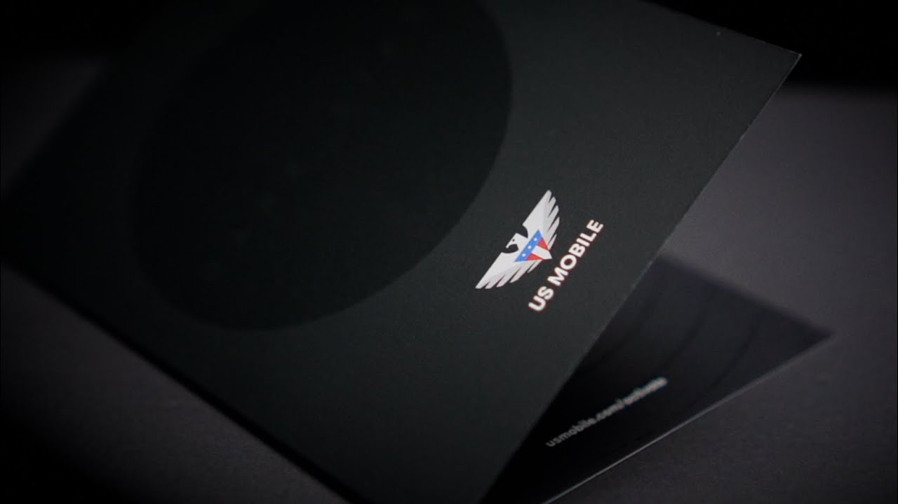

## Introduction to Dark Star

On August 1, 2024, US Mobile officially launched its "Dark Star" network, marking a significant milestone in the company's evolution as a "Super Carrier." This new addition, which leverages AT&T's extensive infrastructure, complements US Mobile's existing Warp (Verizon) and Light Speed (T-Mobile) networks. With Dark Star, US Mobile now offers coverage across all three major networks in the U.S., excluding DISH, positioning itself as a versatile and flexible provider capable of meeting diverse user needs.

### The Vision Behind Dark Star

Dark Star was developed in response to growing customer demand for faster speeds, broader coverage, and more control over their mobile experience. According to US Mobile, the network was meticulously designed to deliver superior performance in various scenarios, from casual browsing to data-intensive activities like HD streaming and online gaming. The launch of Dark Star represents not just an expansion of coverage, but a commitment to providing a highly customizable mobile experience that adapts to the unique needs of each user [source](https://www.usmobile.com).

US Mobile's CEO, Ahmed Khattak, described the network as "a significant leap forward in our mission to offer the most comprehensive and user-centric mobile service in the industry. With Dark Star, we’re not just adding another network; we’re redefining what it means to be a carrier in today’s connected world."

### What is Dark Star?

Dark Star is built on AT&T's infrastructure, known for its reliability and wide reach. This network brings several advanced features to the table, making it a compelling option for both new and existing US Mobile customers. One of the standout features of Dark Star is its prioritization of data traffic through the use of Quality of Service Class Identifier (QCI) levels.

By default, Dark Star operates on QCI9, which is comparable to the standard service level offered by many AT&T plans. However, users have the option to upgrade to QCI8 for an additional fee, which provides higher priority during network congestion, leading to faster data speeds and reduced latency. This makes Dark Star particularly attractive to power users who require consistent high performance even during peak usage times [source](https://bestmvno.com/us-mobile/us-mobiles-att-dark-star/).

### Early User Feedback and Experiences

The reception of Dark Star has been overwhelmingly positive, particularly among tech-savvy users who appreciate the network's advanced features and flexibility. On Reddit, users have been discussing their experiences with the network since its launch, providing valuable insights into its performance and value proposition.

One user shared, "Teleport is an absolute game-changer. Being able to switch between Verizon, T-Mobile, and AT&T on the fly means I'm never without a strong signal, no matter where I am. It's perfect for anyone who travels a lot."

Another Redditor praised the QCI8 upgrade, stating, "I’ve noticed a significant difference in speed and responsiveness since I upgraded to QCI8. It’s especially noticeable when I'm in crowded areas or during peak times. The $12 per month is worth it for me, given how much I rely on my phone for work and entertainment" [source](https://www.reddit.com).

However, not all feedback has been without critique. Some users have expressed concerns about the additional costs associated with the premium features. As one user pointed out, "The base service is great, but the add-ons can add up quickly. It's not a dealbreaker, but it's something to consider if you're on a tight budget."

Despite these concerns, the overall sentiment is that Dark Star delivers on its promises, particularly for users who prioritize performance and flexibility in their mobile service. The combination of comprehensive coverage, customizable service options, and advanced features like the Teleport and QCI8 upgrade has positioned Dark Star as a strong contender in the competitive mobile market [source](https://bestmvno.com/us-mobile/us-mobiles-att-dark-star/).

### The Technical Side: Understanding QCI Levels

To fully appreciate what Dark Star offers, it's important to understand the role of QCI levels in mobile networks. QCI, or Quality of Service Class Identifier, is a standard used by mobile networks to manage and prioritize data traffic. Essentially, QCI levels determine the "lane" your data travels in—higher QCI levels mean faster speeds and better performance during times of heavy network usage.

On Dark Star, the default QCI9 level provides a solid and reliable connection for most users, ensuring fair access and good quality even during peak times. However, for those who need more—whether for streaming high-definition content, gaming, or running data-heavy applications—the QCI8 upgrade is available. This upgrade moves your data to a higher priority lane, resulting in faster speeds and lower latency [source](https://www.usmobile.com).

One user on Reddit summarized it well: "Think of QCI levels like traffic lanes on a highway. With QCI8, you're essentially in the fast lane, which is perfect for when you need to get somewhere quickly without any slowdowns."

### The Benefits of Dark Star’s Teleport Feature

One of the most innovative features of Dark Star is the Teleport capability, which allows users to switch between the three major networks supported by US Mobile—Verizon, T-Mobile, and AT&T—at any time during their billing cycle. This feature ensures that users always have access to the best possible network for their location, eliminating the need to worry about coverage gaps or weak signals.

For frequent travelers, this feature is invaluable. As one user noted, "Teleport gives me peace of mind. No more dropped calls or slow data because I'm in a bad coverage area. I just switch networks and keep going" [source](https://bestmvno.com/us-mobile/us-mobiles-att-dark-star/).

The first two Teleports are free, and additional switches are available for a nominal fee of $2 each. This flexibility, combined with the wide coverage of the Dark Star network, makes US Mobile a highly attractive option for users who demand the best in connectivity.

### Dark Star and the Future of Mobile Connectivity

The launch of Dark Star is a clear indication of US Mobile's ambitions in the mobile industry. By offering coverage on three major networks and introducing innovative features like Teleport and QCI prioritization, US Mobile is positioning itself as a leader in providing flexible, high-performance mobile services.

As the company continues to expand and refine its offerings, it’s likely that we’ll see even more advancements in the near future. Whether you’re a heavy data user, a frequent traveler, or someone who simply wants reliable coverage wherever you go, Dark Star offers a compelling solution that’s hard to beat.

### Conclusion

US Mobile's Dark Star network is more than just an expansion of coverage—it's a bold step forward in the evolution of mobile service. With its advanced features, flexible service options, and the ability to switch between networks at will, Dark Star sets a new standard for what a mobile network can offer.

For users who demand the best in speed, coverage, and reliability, Dark Star is a network worth considering. And with the positive feedback already pouring in from early adopters, it's clear that US Mobile has struck a chord with its latest innovation.

To learn more about Dark Star and see if it’s the right fit for you, visit [US Mobile's official website](https://www.usmobile.com).
