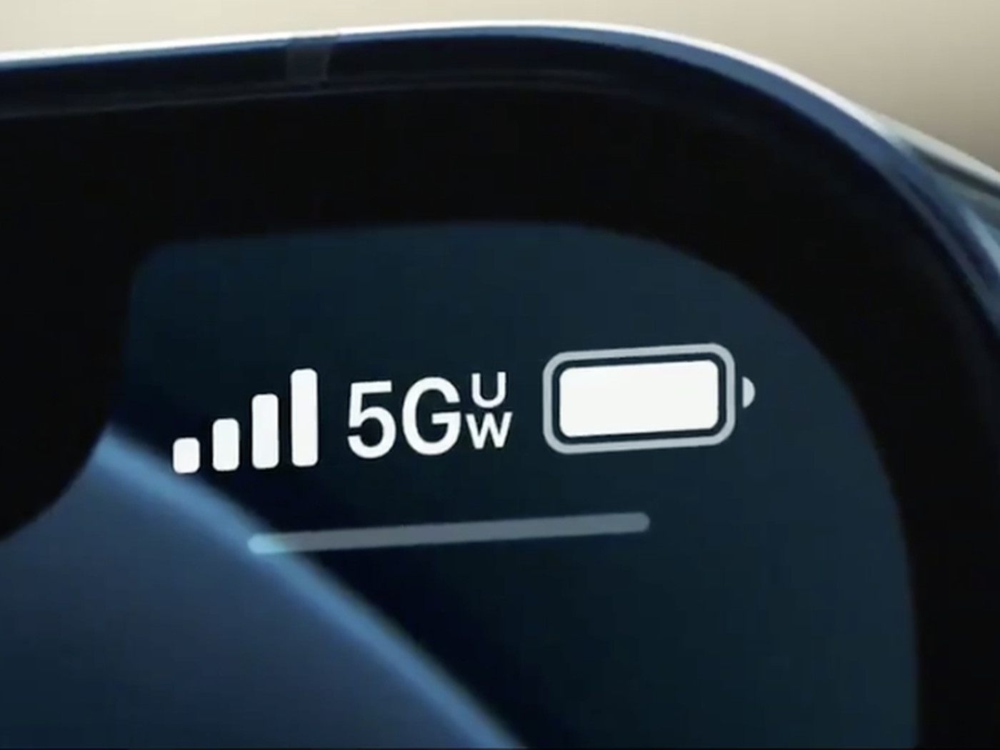

## Verizon's 5G Ultra Wideband Breaks Speed Records in California

Verizon's 5G Ultra Wideband (UW) network is reaching unprecedented speeds across California, providing users with lightning-fast connectivity that significantly outpaces previous generations. Recent tests have shown that the UW network is achieving peak download speeds of up to **4 Gbps** in certain areas, setting a new standard for mobile internet performance.

## Unmatched Speeds Across the Golden State

Whether you're in the bustling streets of Los Angeles or the tech hubs of Silicon Valley, Verizon's UW network ensures you have access to the fastest mobile internet available. The network's use of advanced technologies like carrier aggregation is allowing for record-setting speeds, with users across the state reporting highly consistent and reliable performance.

## Extensive Coverage and High Network Quality

California Verizon users are particularly satisfied with the network's widespread coverage, which blankets much of the state in C-Band and mmWave 5G. Even in areas where the UW network is not available, Verizon's robust 4G LTE network continues to deliver impressive speeds, often exceeding **200 Mbps**.

## Accessibility Across Multiple Plans

One of the standout features of Verizon's UW network is its accessibility across a variety of mobile plans. Whether you're on a traditional Verizon plan, a Visible+ plan, or even a plan from US Mobile, you can tap into the power of 5G UW. This flexibility means that more users can experience top-tier mobile internet without being locked into a single carrier's premium plan.

- **Verizon Plans**: Most postpaid plans include access to the 5G UW network, giving users unparalleled speed and reliability.
- **Visible+**: Visible's premium offering, Visible+, also includes access to the UW network, bringing high-speed connectivity to budget-conscious consumers.
- **US Mobile**: Known for its customizable plans, US Mobile allows users to add 5G UW access to their existing plan, providing an affordable way to experience Verizon's top-tier network.

## What Do These Numbers Mean?

The 4 Gbps download speeds on Verizon's UW network translate to faster downloads, smoother streaming, and lag-free gaming experiences. These speeds are especially beneficial for data-heavy tasks, such as downloading large files or streaming 4K video, where the difference between 4G LTE and 5G UW becomes most apparent.

## The Future of Mobile Connectivity

As Verizon continues to expand its UW network across the country, more users will gain access to these incredible speeds. This expansion, coupled with the network's availability across multiple mobile plans, is setting the stage for a new era of mobile connectivity.

Whether you're a power user who needs the fastest speeds available or simply looking to upgrade your mobile experience, Verizon's 5G Ultra Wideband network in California is pushing the boundaries of what's possible.

## Conclusion

Verizon's commitment to delivering high-speed 5G to more people is evident in its recent network expansions and the availability of 5G UW across various plans. As California enjoys the benefits of this ultra-fast network, users can expect even more innovations and enhancements in the future.

**Links to Plans:**

- [Verizon Plans](https://www.verizon.com/plans/)
- [Visible+](https://www.visible.com/plan/plus)
- [US Mobile](https://www.usmobile.com/)
